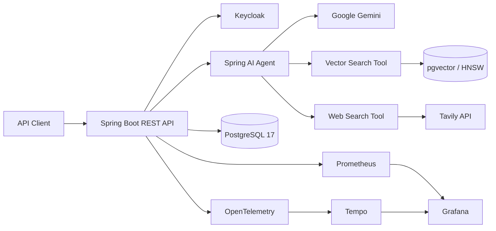

# ONDA Agentic RAG

[](https://github.com/BrahimNajiCode/onda-agentic-rag/actions/workflows/ci.yml)
[](https://openjdk.org/projects/jdk/21/)
[](https://spring.io/projects/spring-boot)
[](https://spring.io/projects/spring-ai)
[](https://www.postgresql.org/)
[](https://docs.docker.com/compose/)

An enterprise-grade, agentic Retrieval-Augmented Generation backend for the **Office National Des Aéroports (ONDA)**. The service combines private document retrieval through PostgreSQL and pgvector with live web search, secure identity management, persistent conversations, and production-oriented observability.

## Highlights

- **Agentic RAG** powered by Spring AI and Google Gemini
- **Hybrid document retrieval** through pgvector and PostgreSQL French full-text search, plus Tavily web search
- **Document ingestion** for PDF, TXT, and Markdown files with Apache Tika
- **Secure, stateless API** backed by Keycloak, OAuth 2.0, and JWT
- **User-isolated data** for conversations and uploaded documents
- **Modular monolith** organized around clear business capabilities
- **End-to-end observability** with Actuator, Prometheus, OpenTelemetry, Tempo, and Grafana
- **Comprehensive test suite** with JUnit 5, MockMvc, H2, and Testcontainers

## Architecture



The codebase follows a modular-monolith structure under `ma.onda.rag`:

```text
agent/          LLM orchestration and callable retrieval tools
conversation/   Conversations, messages, chat API, and persistence
document/       File ingestion, chunking, vectorization, and lifecycle
identity/       Keycloak integration, authentication, and registration saga
user/           Local user profiles and repository
shared/         Security, persistence auditing, exceptions, and handlers
```

Each business module is split into `api`, `application`, `domain`, and `infra` layers where appropriate.

## Technology Stack

| Area | Technologies |
|---|---|
| Runtime | Java 21, Spring Boot 4.1, Maven |
| AI | Spring AI 2.0, Google Gemini, Ollama `nomic-embed-text` embeddings |
| Retrieval | PostgreSQL 17, pgvector/HNSW, French full-text search/GIN, reciprocal-rank fusion |
| Documents | Apache Tika, Spring AI `TokenTextSplitter` |
| Security | Spring Security, OAuth 2.0 Resource Server, JWT, Keycloak 26 |
| Persistence | Spring Data JPA, Hibernate, PostgreSQL |
| Web search | Tavily API |
| Observability | Actuator, Micrometer, Prometheus, OpenTelemetry, Tempo, Grafana |
| Testing | JUnit 5, AssertJ, Mockito, MockMvc, H2, Testcontainers |

## Prerequisites

- JDK 21
- Docker Engine with Docker Compose
- A Google Gemini API key
- A Tavily API key

The Maven Wrapper is included, so a system-wide Maven installation is not required.

## Getting Started

### 1. Clone the repository

```bash
git clone https://github.com/BrahimNajiCode/onda-agentic-rag.git
cd onda-agentic-rag
```

### 2. Configure the environment

Create a `.env` file at the project root:

```dotenv
GEMINI_API_KEY=your-gemini-api-key
GEMINI_PROJECT_ID=your-google-project-id
TAVILY_API_KEY=your-tavily-api-key
KEYCLOAK_CLIENT_SECRET=your-keycloak-client-secret
```

Optional variables include `POSTGRES_DB`, `POSTGRES_USER`, `POSTGRES_PASSWORD`, `KEYCLOAK_REALM`, `KEYCLOAK_SERVER_URL`, `GEMINI_CHAT_MODEL`, and `GEMINI_EMBEDDING_MODEL`.

> Never commit `.env` or production credentials. The file is already excluded by `.gitignore`.

### 3. Start PostgreSQL and Keycloak

```bash
docker compose up -d postgres keycloak
```

Wait until both containers are healthy:

```bash
docker compose ps
```

This provisions:

- PostgreSQL with the `vector` and `uuid-ossp` extensions
- the relational domain schema and the Spring AI `vector_store`
- an HNSW cosine-similarity index over 768-dimensional embeddings
- Keycloak realm `onda-rag-realm` and client `onda-rag-api`

### 4. Run the application

Linux or macOS:

```bash
./mvnw spring-boot:run
```

Windows:

```powershell
.\mvnw.cmd spring-boot:run
```

The API starts at `http://localhost:8080`. Keycloak is available at `http://localhost:8081`.

On startup, Flyway also upgrades an existing development `vector_store` with a
stored French `search_vector` and a GIN index. No volume deletion, re-upload, or
re-embedding is needed. See [Database migrations](#database-migrations) before
upgrading a large or production database.

## Core Workflows

### Document ingestion

Users with the `INGESTOR` role can upload PDF, TXT, or Markdown files up to 50 MB. Documents are parsed with Apache Tika, split into chunks, embedded with Ollama `nomic-embed-text` (768 dimensions), and stored in pgvector with source metadata.

Default retrieval configuration:

| Setting | Value |
|---|---:|
| Embedding dimensions | 768 |
| Vector index | HNSW |
| Distance | Cosine |
| Selected context documents | 4 |

### Modular private-document retrieval

The gated DEEP profile and its 60-question frozen ONDA evaluation set are documented
in [evaluation/onda-v1/README.md](evaluation/onda-v1/README.md). Multi-query expansion
and HyDE are separate opt-in experiments; neither is enabled in production without
a passing reviewed benchmark and agreed limits. The current [benchmark decision](evaluation/onda-v1/BENCHMARK.md)
retains BALANCED.

`VectorSearchTool` maps tool input/output and delegates to
`agent.application.retrieval.OndaRetrievalPipeline`. All retrieval profiles run:

```text
QueryTransformer chain -> QueryExpander -> DocumentRetriever -> DocumentJoiner
    -> DocumentPostProcessor chain -> RetrievalResult
```

The default has no query transformers and expands to the single original query.
The original query is now always retained even when rewriting or expansion is enabled.
`FAST` uses `VectorStoreDocumentRetriever` for dense candidates and
`ConcatenationDocumentJoiner` to join results. `BALANCED` uses
`HybridDocumentRetriever`: dense retrieval and `PostgresFullTextDocumentRetriever`
run concurrently, then reciprocal-rank fusion (RRF) combines their ranked lists
by stable chunk ID. Lexical search uses `websearch_to_tsquery('french', ...)` and
`ts_rank_cd`, searching both chunk content and its source filename.

| Profile | Dense candidates | Dense similarity threshold | Lexical candidates | Final context limit |
|---|---:|---:|---:|---:|
| `FAST` | 8 | 0.5 | None | 4 |
| `BALANCED` (application default) | 20 | 0.0 | 20 | 4 |

In both profiles, `OndaDocumentPostProcessor` removes blank chunks, deduplicates by
stable chunk ID, optionally reranks all candidates in one batch, selects whole
chunks within the evidence-count and context-token limits, then optionally adds
adjacent chunks using only the remaining budget. Identical text from different
chunk IDs retains its separate provenance. Neither profile adds LLM query expansion.

```yaml
rag:
  pre-retrieval:
    rewrite:
      enabled: false
  retrieval:
    profile: BALANCED # Switch to FAST for dense-only agent tool retrieval.
    top-k: 8
    similarity-threshold: 0.5
    balanced:
      dense-candidates: 20
      lexical-candidates: 20
      similarity-threshold: 0.0
      rrf-k: 60
  post-retrieval:
    max-documents: 4
    context-token-budget: 4096
    adjacent-chunks-enabled: false
    reranking:
      enabled: false
      endpoint: https://api.cohere.com/v2/rerank
      api-key: ${COHERE_API_KEY:}
      model: rerank-v3.5
      timeout: 2s
      max-concurrent-calls: 4
      failure-threshold: 3
      open-duration: 30s
```

#### Reranking and evidence budgets

`DocumentReranker` is an application port that accepts a query and a bulk list of
`(chunkId, text)` candidates. `CohereDocumentReranker` maps provider response indices
back to stable IDs; citation metadata never leaves the application through this
adapter. The default `rerank-v3.5` model supports multilingual pairs, including
French and Arabic. See the [Cohere model overview](https://docs.cohere.com/docs/rerank-overview)
and [bulk API contract](https://docs.cohere.com/v2/reference/rerank).

Set `RERANKING_ENABLED=true` and `COHERE_API_KEY` to opt in. **Enabling this sends
private query and chunk text to the configured provider**; approve its data handling
before production use. `RERANKING_ENDPOINT` and `RERANKING_MODEL` are configurable.
Missing credentials fail startup only when enabled. No live provider is needed for
the default configuration or the unit tests.

The adapter requests every candidate's score. Higher scores select first; ties
retain RRF order. Missing/invalid scores, provider failures and timeouts fall back
to the entire deduplicated RRF list (cosine order for FAST), then apply the same
budget. The bounded worker pool has no queue. Timed-out work is interrupted but
continues occupying its slot until it exits, even if it ignores interruption.
After `failure-threshold` consecutive failed calls, the circuit opens for
`open-duration`; one probe is allowed after that interval. A successful probe
closes it, a failed probe reopens it. Circuit-open and bulkhead-full calls return
fallback immediately. The managed adapter interrupts remaining workers on shutdown.

`context-token-budget` is enforced conservatively using one token per UTF-8 byte
of the serialized snippet payload, including citation fields, JSON escaping,
separators and response-envelope overhead. This deliberately underfills context
compared with model tokenization; it does not use a language-dependent chars/4
estimate. Oversized chunks are skipped, not truncated, so a smaller later chunk
can fit without changing its citation. Both limits are shared across parallel or
repeated private-document tool calls in a single chat; a direct pipeline call has
its own allowance. Empty tool envelopes, chat history, system prompts, and web
tool output are outside this **private-document evidence** budget, not a total
model-window limit.

Adjacent expansion is disabled by default. When enabled, it fetches immediate
neighbors of selected anchors from PostgreSQL, retaining the parent document,
owner and original metadata filter. It never displaces a selected anchor or
exceeds either limit, and it does not recurse. Missing chunk indices are skipped;
an expansion failure retains selected evidence. Neighbors keep their own citation
metadata and have `scoreType: ADJACENT_CONTEXT`, with no fabricated relevance or
reranker score.

Setting `rag.pre-retrieval.rewrite.enabled=true` opts into the earlier
French-preserving rewrite experiment through a dedicated client with no tools.
This adds an LLM call and a second retrieval query when rewriting changes the text.
A missing transformed query retains the previous query;
an empty expansion retains the transformed query. Provider failures propagate
instead of returning a misleading successful empty result.

Application callers can use `pipeline.retrieve(new RetrievalRequest("accès CMN"))`.
An omitted/null profile uses `rag.retrieval.profile`; an explicit
`new RetrievalRequest("accès CMN", RetrievalProfile.BALANCED, Map.of())` overrides it.
The result contains selected Spring AI documents (including their metadata), typed
source evidence, executed query texts, the profile, and stage/total durations.
Null or blank input returns empty evidence without running retrieval. An optional
application-supplied request context is preserved across query stages, including
Spring AI vector-store filter expressions applied to both retrieval arms; the tool does not expose that context
to the model. This feature does not introduce corpus authorization policy.

Micrometer timer `rag.retrieval.stage` records `TRANSFORM`, `EXPAND`, `RETRIEVE`,
`JOIN`, `POST_PROCESS`, and `TOTAL`, with only `profile`, `stage`, and `outcome`
tags. Failed stages and failed totals are recorded too. DEBUG logs under
`ma.onda.rag.agent.application.retrieval` contain stage timings, never query text,
document/user IDs, or exception messages. Executed queries are available only in
the explicit result and should not be logged.

Each chat passes its own `RetrievalResults` through Spring AI `ToolContext`, so
vector citations derive from explicit results even when tools execute on worker
threads. The tool's `query` input and `snippets` output remain unchanged. Chat
responses retain their existing source fields and add retrieval diagnostics (see below).
Web and ONDA-web citation transports still use
their existing `ThreadLocal` state; migrating those is separate work.

No `RetrievalAugmentationAdvisor` is installed: the agent still chooses whether
to use private documents, official ONDA web content, general web search, or no
retrieval. New strategies belong behind the pipeline, not in the tool adapter.

The stage contracts and request context follow the
[Spring AI modular RAG reference](https://docs.spring.io/spring-ai/reference/api/retrieval-augmented-generation.html)
and [tool context reference](https://docs.spring.io/spring-ai/reference/api/tools.html#_tool_context).

#### Hybrid scores and diagnostics

For each chunk, `RRF = 1 / (k + denseRank) + 1 / (k + lexicalRank)`, with ranks
starting at 1 and a missing arm contributing zero. The default `k` is 60. Raw
cosine and lexical scores are never added or compared across arms. The output
`Document.score` and source `relevanceScore` are RRF scores for `BALANCED`, including
chunks found in just one arm; they are not probabilities or cosine similarities.
`FAST` retains its existing cosine score semantics. Consumers should use the
result profile to interpret scores rather than compare them across profiles.

Each hybrid document carries `metadata.retrieval` with `score_type: RRF`,
`rrf_score`, `rrf_k`, and the available `dense_rank`, `dense_score`, `lexical_rank`,
and `lexical_score`. Existing source metadata remains intact. Tied fused scores
sort by chunk ID, independent of which search finishes first. `RankedDocumentJoiner`
preserves that order and keeps the best RRF score when a chunk appears in multiple
expanded-query results.

Post-processing adds `reranker_score` only on successful scoring,
`reranker_status` (`SUCCESS`, `DISABLED`, `TIMEOUT`, `ERROR`, `CIRCUIT_OPEN`,
`BULKHEAD_FULL`, or `INTERRUPTED`), and the conservative per-chunk `context_tokens`
charge. It never replaces the cosine, lexical, or RRF scores with a reranker score.

The retrieval executor is managed by Spring and closed on shutdown. Each query
starts two candidate tasks; account for the extra database connections when
sizing the connection pool. A failed arm fails the retrieval rather than silently
returning partial evidence. The existing `RETRIEVE` timer includes both searches
and fusion; metrics keep their bounded profile/stage tags.

See the [PostgreSQL full-text controls](https://www.postgresql.org/docs/17/textsearch-controls.html)
and [pgvector hybrid search guidance](https://github.com/pgvector/pgvector#hybrid-search).

### Agentic chat

For every chat request, the service persists the user message, loads the ordered conversation history, and invokes Gemini. The model may call:

- `vectorSearchTool` for private enterprise knowledge;
- `webSearchTool` for current external information when internal context is insufficient.

The assistant response, cited internal sources, and token usage are returned to the caller, while the conversation history is persisted in PostgreSQL.

#### Chat response retrieval details

`POST /api/v1/chat` retains `answer`, `sources`, and `tokenUsage` and adds
`retrievals`: one entry per completed private-document retrieval call. Its `id`
is a response-local, one-based identifier (not a database ID or chronological
start order when tools run concurrently). Each document source's
`retrieval.executionId` links to that entry.

Example BALANCED response, with illustrative IDs and timings:

```json
{
  "answer": "La procédure ONDA-SEC-402 décrit les autorisations des visiteurs.",
  "sources": [
    {
      "type": "DOCUMENT",
      "documentId": "doc-1",
      "title": "procedures.pdf",
      "url": null,
      "snippet": "La procédure ONDA-SEC-402 définit les autorisations des visiteurs.",
      "relevanceScore": 0.03278688524590164,
      "retrieval": {
        "executionId": 1,
        "chunkId": "chunk-1",
        "profile": "BALANCED",
        "scoreType": "RRF",
        "rrfK": 60,
        "dense": { "rank": 1, "score": 0.89 },
        "lexical": { "rank": 1, "score": 0.2 }
      }
    }
  ],
  "tokenUsage": { "promptTokens": 120, "completionTokens": 30, "totalTokens": 150 },
  "retrievals": [
    {
      "id": 1,
      "profile": "BALANCED",
      "executedQueries": ["ONDA-SEC-402"],
      "selectedChunkCount": 1,
      "timingsMs": {
        "TRANSFORM": 0.125,
        "EXPAND": 0.025,
        "RETRIEVE": 12.0,
        "JOIN": 0.25,
        "POST_PROCESS": 0.1,
        "TOTAL": 14.0
      }
    }
  ]
}
```

`type` still identifies the source kind (`DOCUMENT`, `WEB`, or `ONDA_WEB`);
`retrieval.profile` identifies how a document was retrieved. For `FAST`,
`scoreType` is `COSINE_SIMILARITY`, `dense.score` equals `relevanceScore`, and
`rrfK`, `lexical`, and `dense.rank` are null because FAST does not retain original
candidate ranks. For `BALANCED`, `relevanceScore` is the fused RRF score;
`dense.score` and `lexical.score` are their separate raw scores, and ranks are
one-based positions in the original candidate lists. A missing arm is null.

`retrieval.rrfScore`, `rerankerScore`, `rerankerStatus`, and `contextTokens` expose
the corresponding post-processing diagnostics separately. `relevanceScore`
retains its existing meaning even when evidence order is changed by reranking.

Web sources have `retrieval: null` and retain their provider's relevance score.
When the model does not call private-document retrieval, `retrievals` is empty;
when a call finds nothing, its entry remains with `selectedChunkCount: 0`.
Timings are numeric milliseconds, including fractional milliseconds, for the
stages actually executed. They measure retrieval work, not total chat latency.
Only allowed diagnostics are mapped: uploaded-user IDs, filters, and arbitrary
document metadata are not returned. Executed queries can contain user text;
avoid logging the entire response. These diagnostics describe retrieved evidence,
not a guarantee that every returned source supports a specific answer sentence.

### Identity and authorization

Keycloak realm roles form the following hierarchy:

| Role | Capabilities |
|---|---|
| `USER` | Chat, profile, and personal conversation management |
| `INGESTOR` | Inherits `USER`; uploads, lists, and deletes owned documents |
| `ADMIN` | Inherits `INGESTOR`; reserved for system administration |

Registration uses a compensating transaction: a user is first created in Keycloak and then persisted locally. If the database write fails, the Keycloak user is deleted to prevent an orphaned identity.

## REST API

All endpoints are prefixed with `/api/v1`.

| Method | Endpoint | Access | Description |
|---|---|---|---|
| `POST` | `/auth/register` | Public | Register a user |
| `POST` | `/auth/login` | Public | Obtain access and refresh tokens |
| `POST` | `/auth/refresh` | Public | Refresh tokens |
| `POST` | `/auth/logout` | `USER` | Revoke a session |
| `PUT` | `/auth/change-password` | `USER` | Change the current password |
| `GET` | `/users/me` | Authenticated | Get the current user profile |
| `POST` | `/conversations` | Authenticated | Create a conversation |
| `GET` | `/conversations` | Authenticated | List personal conversations |
| `GET` | `/conversations/{id}` | Authenticated | Get a conversation and its messages |
| `DELETE` | `/conversations/{id}` | Authenticated | Delete a conversation |
| `POST` | `/chat` | Authenticated | Send a message to the RAG agent |
| `POST` | `/documents` | `INGESTOR` | Upload and index a document |
| `GET` | `/documents` | `INGESTOR` | List owned documents |
| `DELETE` | `/documents/{id}` | `INGESTOR` | Delete a document and its vectors |

Protected requests require an access token:

```http
Authorization: Bearer <access-token>
```

Authentication, authorization, validation, and business errors use structured HTTP responses, including RFC 7807 Problem Details for security failures.

## Observability

Start the optional local observability stack after launching the application:

```bash
docker compose --profile observability up -d
```

| Service | URL | Purpose |
|---|---|---|
| Application health | http://localhost:8080/actuator/health | Readiness and liveness |
| Prometheus | http://localhost:9090 | Metrics collection and queries |
| Grafana | http://localhost:3000 | Dashboards and trace exploration |
| Tempo | http://localhost:3200 | Distributed trace storage |

Prometheus scrapes the application every 15 seconds. OpenTelemetry traces are exported to Tempo, and logs include `traceId` and `spanId` correlation fields. Grafana is automatically provisioned with the **ONDA Agentic RAG Overview** dashboard.

## Testing

Run the complete verification suite:

```bash
./mvnw verify
```

On Windows:

```powershell
.\mvnw.cmd verify
```

The suite contains unit, MVC, JPA slice, security, and integration tests. Testcontainers starts real PostgreSQL/pgvector and Keycloak instances for end-to-end scenarios, while AI models are replaced with deterministic test doubles so the build does not call external AI services.

Hybrid retrieval tests cover RRF arithmetic, stable ordering, concurrent execution,
metadata filters, and upgrading a populated pre-Flyway database. The labeled fixture
at `src/test/resources/retrieval/hybrid-fixtures.json` covers identifiers, filenames,
dates, airport codes, French word forms, and a semantic paraphrase. Controlled
synthetic embeddings produce 1/6 relevant hits for `FAST` and 6/6 for `BALANCED`
within the final four chunks. This verifies the hybrid mechanism, not real-world
embedding-model quality; it is not a production recall benchmark.

GitHub Actions runs the same Maven verification on every push and pull request targeting `main`.

## Data Model

The primary PostgreSQL tables are:

- `users` — local profiles linked to Keycloak subjects;
- `conversations` — user-owned conversation threads;
- `chat_messages` — ordered and immutable message history;
- `documents` — uploaded-document metadata and processing status;
- `vector_store` — text chunks, JSONB metadata, and 768-dimensional embeddings.

The application uses `spring.jpa.hibernate.ddl-auto=validate`; the development schema is initialized by `docker/postgres/init.sql`.

### Database migrations

Flyway migrations live in `src/main/resources/db/migration`. On an existing
development schema without Flyway history, `baseline-on-migrate: true` and
`baseline-version: 0` register the schema before applying
`V1__add_vector_store_full_text_search.sql`. Existing chunks, embeddings, and
metadata are preserved. A second startup validates migration history without
reapplying V1.

V1 adds a stored generated `search_vector` over French content and source filenames
(filename weight A, content weight D), plus `idx_vector_store_search_vector_gin`.
Existing rows are backfilled; inserts and content/filename updates refresh the
column automatically. On an empty database, V1 creates the vector table first;
the domain tables still need the existing Docker bootstrap or their normal setup.

This migration targets the repository's `public.vector_store` and 768-dimensional
fresh-store schema. Custom vector schemas/table names require corresponding
migrations and retriever configuration changes. Back up the target database and
schedule the first migration: adding the stored column and building the index
can lock the table and take time on large corpora. The database user must be able
to alter the table and create the index (and install `vector` on a fresh database).
Automatic baselining is intended to adopt the known development schema; verify
the target database before enabling it in another environment. Do not edit V1
after deployment; add a new versioned migration for later changes.

See [PostgreSQL generated full-text columns](https://www.postgresql.org/docs/17/textsearch-tables.html).

## Project Structure

```text
.
├── .github/workflows/ci.yml          # Continuous integration
├── docker/
│   ├── keycloak/                     # Realm import
│   ├── observability/                # Grafana, Prometheus, and Tempo
│   └── postgres/init.sql             # Database and pgvector schema
├── src/
│   ├── main/java/ma/onda/rag/        # Application modules
│   ├── main/resources/               # Spring configuration
│   └── test/                         # Unit and integration tests
├── docker-compose.yml
├── pom.xml
└── README.md
```

## Security Notes

- Use dedicated secrets and strong credentials outside local development.
- Rotate any development credentials before deploying the service.
- Keep `.env` and provider API keys out of source control.
- Restrict Actuator and observability endpoints appropriately in production.
- Place Keycloak and PostgreSQL behind private network boundaries.

## Continuous Integration

The CI pipeline is defined in `.github/workflows/ci.yml`. It checks out the repository, installs Temurin JDK 21 with Maven dependency caching, and runs:

```bash
./mvnw -B -ntp verify
```

---

Built with Spring Boot, Spring AI, PostgreSQL, pgvector, and Keycloak.
