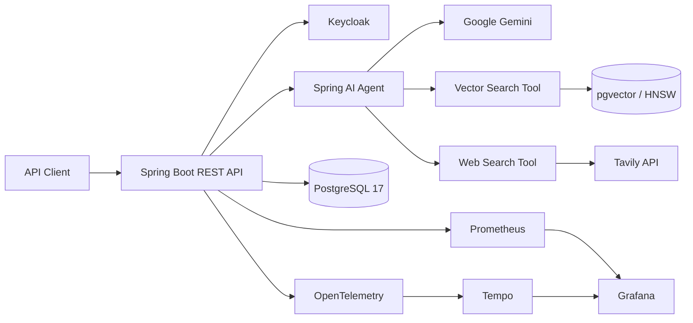

# ONDA Agentic RAG

[](https://github.com/BrahimNajiCode/onda-agentic-rag/actions/workflows/ci.yml)
[](https://openjdk.org/projects/jdk/21/)
[](https://spring.io/projects/spring-boot)
[](https://spring.io/projects/spring-ai)
[](https://www.postgresql.org/)
[](https://docs.docker.com/compose/)

An enterprise-grade, agentic Retrieval-Augmented Generation backend for the **Office National Des Aéroports (ONDA)**. The service combines private document retrieval through PostgreSQL and pgvector with live web search, secure identity management, persistent conversations, and production-oriented observability.

## Highlights

- **Agentic RAG** powered by Spring AI and Google Gemini
- **Hybrid knowledge access** through pgvector semantic search and Tavily web search
- **Document ingestion** for PDF, TXT, and Markdown files with Apache Tika
- **Secure, stateless API** backed by Keycloak, OAuth 2.0, and JWT
- **User-isolated data** for conversations and uploaded documents
- **Modular monolith** organized around clear business capabilities
- **End-to-end observability** with Actuator, Prometheus, OpenTelemetry, Tempo, and Grafana
- **Comprehensive test suite** with JUnit 5, MockMvc, H2, and Testcontainers

## Architecture



The codebase follows a modular-monolith structure under `ma.onda.rag`:

```text
agent/          LLM orchestration and callable retrieval tools
conversation/   Conversations, messages, chat API, and persistence
document/       File ingestion, chunking, vectorization, and lifecycle
identity/       Keycloak integration, authentication, and registration saga
user/           Local user profiles and repository
shared/         Security, persistence auditing, exceptions, and handlers
```

Each business module is split into `api`, `application`, `domain`, and `infra` layers where appropriate.

## Technology Stack

| Area | Technologies |
|---|---|
| Runtime | Java 21, Spring Boot 4.1, Maven |
| AI | Spring AI 2.0, Google Gemini, Google GenAI embeddings |
| Retrieval | PostgreSQL 17, pgvector, HNSW cosine similarity |
| Documents | Apache Tika, Spring AI `TokenTextSplitter` |
| Security | Spring Security, OAuth 2.0 Resource Server, JWT, Keycloak 26 |
| Persistence | Spring Data JPA, Hibernate, PostgreSQL |
| Web search | Tavily API |
| Observability | Actuator, Micrometer, Prometheus, OpenTelemetry, Tempo, Grafana |
| Testing | JUnit 5, AssertJ, Mockito, MockMvc, H2, Testcontainers |

## Prerequisites

- JDK 21
- Docker Engine with Docker Compose
- A Google Gemini API key
- A Tavily API key

The Maven Wrapper is included, so a system-wide Maven installation is not required.

## Getting Started

### 1. Clone the repository

```bash
git clone https://github.com/BrahimNajiCode/onda-agentic-rag.git
cd onda-agentic-rag
```

### 2. Configure the environment

Create a `.env` file at the project root:

```dotenv
GEMINI_API_KEY=your-gemini-api-key
GEMINI_PROJECT_ID=your-google-project-id
TAVILY_API_KEY=your-tavily-api-key
KEYCLOAK_CLIENT_SECRET=your-keycloak-client-secret
```

Optional variables include `POSTGRES_DB`, `POSTGRES_USER`, `POSTGRES_PASSWORD`, `KEYCLOAK_REALM`, `KEYCLOAK_SERVER_URL`, `GEMINI_CHAT_MODEL`, and `GEMINI_EMBEDDING_MODEL`.

> Never commit `.env` or production credentials. The file is already excluded by `.gitignore`.

### 3. Start PostgreSQL and Keycloak

```bash
docker compose up -d postgres keycloak
```

Wait until both containers are healthy:

```bash
docker compose ps
```

This provisions:

- PostgreSQL with the `vector` and `uuid-ossp` extensions
- the relational domain schema and the Spring AI `vector_store`
- an HNSW cosine-similarity index over 768-dimensional embeddings
- Keycloak realm `onda-rag-realm` and client `onda-rag-api`

### 4. Run the application

Linux or macOS:

```bash
./mvnw spring-boot:run
```

Windows:

```powershell
.\mvnw.cmd spring-boot:run
```

The API starts at `http://localhost:8080`. Keycloak is available at `http://localhost:8081`.

## Core Workflows

### Document ingestion

Users with the `INGESTOR` role can upload PDF, TXT, or Markdown files up to 50 MB. Documents are parsed with Apache Tika, split into chunks, embedded with Google GenAI, and stored in pgvector with source metadata.

Default retrieval configuration:

| Setting | Value |
|---|---:|
| Embedding dimensions | 768 |
| Vector index | HNSW |
| Distance | Cosine |
| Dense candidates (top K) | 8 |
| Similarity threshold | 0.5 |
| Selected context documents | 4 |

### Modular private-document retrieval

`VectorSearchTool` maps tool input/output and delegates to
`agent.application.retrieval.OndaRetrievalPipeline`. The initial `FAST` profile runs:

```text
QueryTransformer chain -> QueryExpander -> DocumentRetriever -> DocumentJoiner
    -> DocumentPostProcessor chain -> RetrievalResult
```

The default has no query transformers and expands to the single original query.
`VectorStoreDocumentRetriever` retrieves dense candidates, `ConcatenationDocumentJoiner`
joins results by chunk ID and score, and `OndaDocumentPostProcessor` removes blank
and normalized-text duplicate chunks before applying the context limit. It does
not perform semantic reranking, lexical search, or LLM query expansion.

```yaml
rag:
  pre-retrieval:
    rewrite:
      enabled: false
  retrieval:
    top-k: 8
    similarity-threshold: 0.5
  post-retrieval:
    max-documents: 4
```

Setting `rag.pre-retrieval.rewrite.enabled=true` opts into the earlier
French-preserving rewrite experiment through a dedicated client with no tools.
This adds an LLM call. A missing transformed query retains the previous query;
an empty expansion retains the transformed query. Provider failures propagate
instead of returning a misleading successful empty result.

Application callers can use `pipeline.retrieve(new RetrievalRequest("accès CMN"))`.
The result contains selected Spring AI documents (including their metadata), typed
source evidence, executed query texts, the profile, and stage/total durations.
Null or blank input returns empty evidence without running retrieval. An optional
application-supplied request context is preserved across query stages, including
Spring AI vector-store filter expressions; the tool does not expose that context
to the model. This feature does not introduce corpus authorization policy.

Micrometer timer `rag.retrieval.stage` records `TRANSFORM`, `EXPAND`, `RETRIEVE`,
`JOIN`, `POST_PROCESS`, and `TOTAL`, with only `profile`, `stage`, and `outcome`
tags. Failed stages and failed totals are recorded too. DEBUG logs under
`ma.onda.rag.agent.application.retrieval` contain stage timings, never query text,
document/user IDs, or exception messages. Executed queries are available only in
the explicit result and should not be logged.

Each chat passes its own `RetrievalResults` through Spring AI `ToolContext`, so
vector citations derive from explicit results even when tools execute on worker
threads. The tool's `query` input and `snippets` output and the chat's `DOCUMENT`
source format remain unchanged. Web and ONDA-web citation transports still use
their existing `ThreadLocal` state; migrating those is separate work.

No `RetrievalAugmentationAdvisor` is installed: the agent still chooses whether
to use private documents, official ONDA web content, general web search, or no
retrieval. New strategies belong behind the pipeline, not in the tool adapter.

The stage contracts and request context follow the
[Spring AI modular RAG reference](https://docs.spring.io/spring-ai/reference/api/retrieval-augmented-generation.html)
and [tool context reference](https://docs.spring.io/spring-ai/reference/api/tools.html#_tool_context).

### Agentic chat

For every chat request, the service persists the user message, loads the ordered conversation history, and invokes Gemini. The model may call:

- `vectorSearchTool` for private enterprise knowledge;
- `webSearchTool` for current external information when internal context is insufficient.

The assistant response, cited internal sources, and token usage are returned to the caller, while the conversation history is persisted in PostgreSQL.

### Identity and authorization

Keycloak realm roles form the following hierarchy:

| Role | Capabilities |
|---|---|
| `USER` | Chat, profile, and personal conversation management |
| `INGESTOR` | Inherits `USER`; uploads, lists, and deletes owned documents |
| `ADMIN` | Inherits `INGESTOR`; reserved for system administration |

Registration uses a compensating transaction: a user is first created in Keycloak and then persisted locally. If the database write fails, the Keycloak user is deleted to prevent an orphaned identity.

## REST API

All endpoints are prefixed with `/api/v1`.

| Method | Endpoint | Access | Description |
|---|---|---|---|
| `POST` | `/auth/register` | Public | Register a user |
| `POST` | `/auth/login` | Public | Obtain access and refresh tokens |
| `POST` | `/auth/refresh` | Public | Refresh tokens |
| `POST` | `/auth/logout` | `USER` | Revoke a session |
| `PUT` | `/auth/change-password` | `USER` | Change the current password |
| `GET` | `/users/me` | Authenticated | Get the current user profile |
| `POST` | `/conversations` | Authenticated | Create a conversation |
| `GET` | `/conversations` | Authenticated | List personal conversations |
| `GET` | `/conversations/{id}` | Authenticated | Get a conversation and its messages |
| `DELETE` | `/conversations/{id}` | Authenticated | Delete a conversation |
| `POST` | `/chat` | Authenticated | Send a message to the RAG agent |
| `POST` | `/documents` | `INGESTOR` | Upload and index a document |
| `GET` | `/documents` | `INGESTOR` | List owned documents |
| `DELETE` | `/documents/{id}` | `INGESTOR` | Delete a document and its vectors |

Protected requests require an access token:

```http
Authorization: Bearer <access-token>
```

Authentication, authorization, validation, and business errors use structured HTTP responses, including RFC 7807 Problem Details for security failures.

## Observability

Start the optional local observability stack after launching the application:

```bash
docker compose --profile observability up -d
```

| Service | URL | Purpose |
|---|---|---|
| Application health | http://localhost:8080/actuator/health | Readiness and liveness |
| Prometheus | http://localhost:9090 | Metrics collection and queries |
| Grafana | http://localhost:3000 | Dashboards and trace exploration |
| Tempo | http://localhost:3200 | Distributed trace storage |

Prometheus scrapes the application every 15 seconds. OpenTelemetry traces are exported to Tempo, and logs include `traceId` and `spanId` correlation fields. Grafana is automatically provisioned with the **ONDA Agentic RAG Overview** dashboard.

## Testing

Run the complete verification suite:

```bash
./mvnw verify
```

On Windows:

```powershell
.\mvnw.cmd verify
```

The suite contains unit, MVC, JPA slice, security, and integration tests. Testcontainers starts real PostgreSQL/pgvector and Keycloak instances for end-to-end scenarios, while AI models are replaced with deterministic test doubles so the build does not call external AI services.

GitHub Actions runs the same Maven verification on every push and pull request targeting `main`.

## Data Model

The primary PostgreSQL tables are:

- `users` — local profiles linked to Keycloak subjects;
- `conversations` — user-owned conversation threads;
- `chat_messages` — ordered and immutable message history;
- `documents` — uploaded-document metadata and processing status;
- `vector_store` — text chunks, JSONB metadata, and 768-dimensional embeddings.

The application uses `spring.jpa.hibernate.ddl-auto=validate`; the development schema is initialized by `docker/postgres/init.sql`.

## Project Structure

```text
.
├── .github/workflows/ci.yml          # Continuous integration
├── docker/
│   ├── keycloak/                     # Realm import
│   ├── observability/                # Grafana, Prometheus, and Tempo
│   └── postgres/init.sql             # Database and pgvector schema
├── src/
│   ├── main/java/ma/onda/rag/        # Application modules
│   ├── main/resources/               # Spring configuration
│   └── test/                         # Unit and integration tests
├── docker-compose.yml
├── pom.xml
└── README.md
```

## Security Notes

- Use dedicated secrets and strong credentials outside local development.
- Rotate any development credentials before deploying the service.
- Keep `.env` and provider API keys out of source control.
- Restrict Actuator and observability endpoints appropriately in production.
- Place Keycloak and PostgreSQL behind private network boundaries.

## Continuous Integration

The CI pipeline is defined in `.github/workflows/ci.yml`. It checks out the repository, installs Temurin JDK 21 with Maven dependency caching, and runs:

```bash
./mvnw -B -ntp verify
```

---

Built with Spring Boot, Spring AI, PostgreSQL, pgvector, and Keycloak.
